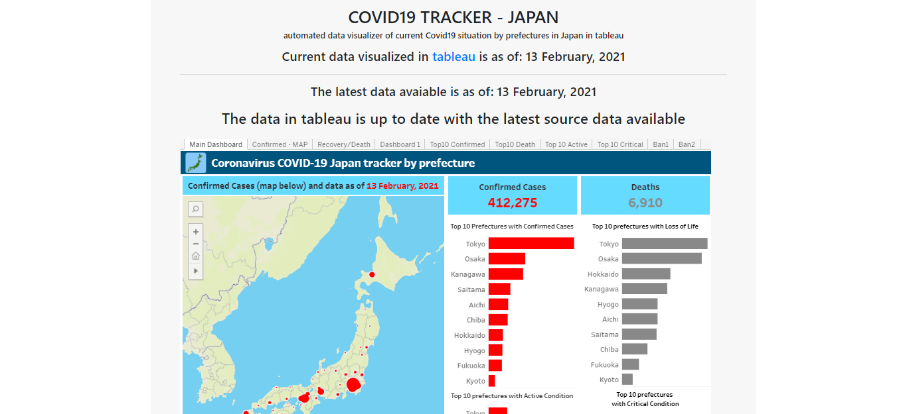

# COVID19 Tracker - JAPAN web application

## About this Project

    
Python web application that automates fetching, processing, updating the latest Covid19 data on Japan as well as the data visualisation with tableau

For more details on how the application was built, 
please take a look at the notes on the <a href="https://covid19-tableau-299208.an.r.appspot.com/tracker" target="_blank">application website</a>
